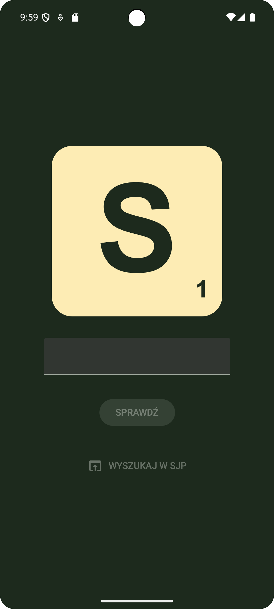
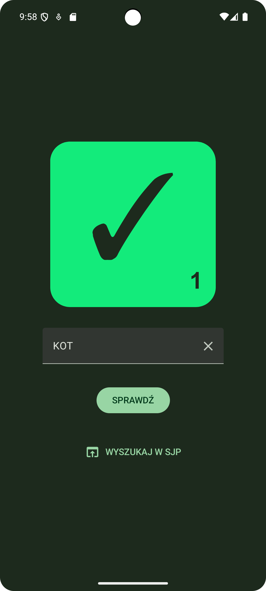
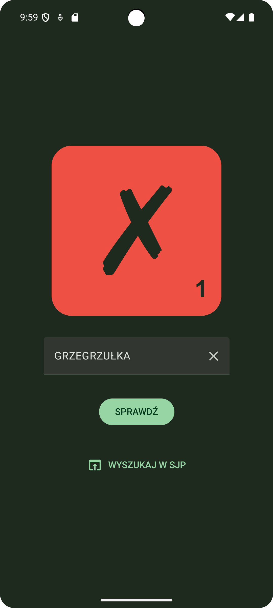

# Słownik Scrabble

[Oficjalny Słownik Polskiego Scrabblisty](https://www.pfs.org.pl/osps_online.php) jako aplikacja mobilna.

## Instrukcja obsługi

1. Wpisz słowo do sprawdzenia w pole tekstowe.
2. Wciśnij przycisk potwierdzenia na klawiaturze ekranowej lub przycisk "Sprawdź".
3. Zmiana płytki na kolor zielony oznacza, że słowo jest poprawne wg OSPS, a na czerwony - że jest niepoprawne.

Dodatkowo dostępny jest przycisk "Wyszukaj w SJP", który otwiera w przeglądarce [Słownik Języka Polskiego SJP](https://sjp.pl/) z definicją sprawdzanego słowa.

 

    
    
    

